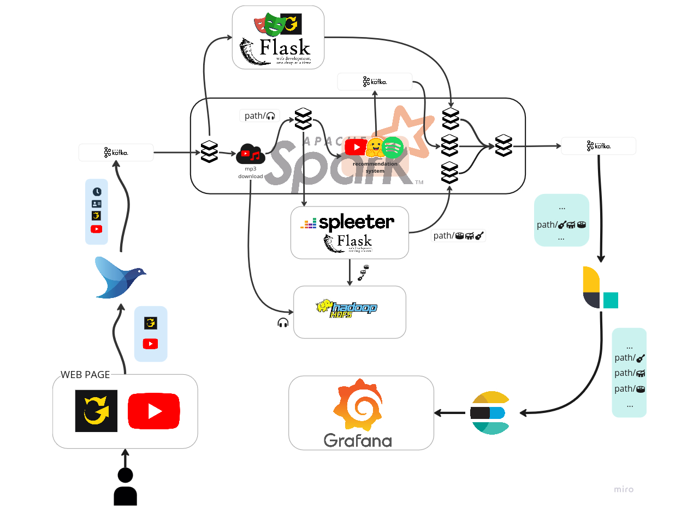

# kCHORDS
It's a data streaming pipeline that takes a YouTube video link and an Ultimate Guitar tabs link as input, and then performs the following operations:

1. Scraping [Ultimate Guitar Tabs](https://www.ultimate-guitar.com/)

Extracts the chords and metrics related to the tab

2. Stem separation

Split the audio track of the video in 5 stems:
- Vocals 🎤
- Bass 🎸
- Piano 🎹
- Drums 🥁
- Other 🎼

3. Recommendation System

based on the song features the content-based system will recommend 5 song to play next

# Architecture


It is made by the following containers:
- **Fluentd**: receives the YouTube & Ultimate Guitar links, adds a timestamp and unique ID, and sends them to Kafka.
- **Kafka**: Uses topics to queue data for Spark processing.
- **Spark**: Orchestrates data extraction, audio separation, and storage.
- **Hdfs**: Stores both the raw audio and processed stems for further analysis.
- **Spleeter**: Separate the audio file into 5 stems
- **Chords_Scraper**: Scrapes and structures guitar tabs from Ultimate Guitar Tabs
- **Logstash**: Ingests processed song data from Kafka topic "songs" into Elasticsearch.
- **Elasticsearch**: Stores and indexes song metadata, extracted tabs, and separated audio tracks.
- **Grafana**: Visualizes everything in an interactive dashboard.

# Running commands
0. To run the project you will need youtube and spotify API TOKENS:

Create a `.env` file with your tokens
```
GOOGLE_TOKEN={YOUR_TOKEN}
SPOTIFY_CLIENT_ID={YOUR_TOKEN}
SPOTIFY_CLIENT_SECRET={YOUR_TOKEN}
SCRAPER_URL=http://chords_scraper:6000/scrape
```


1. Start the project
```
docker compose up --build
```
2. Visit `localhost:3000` and login using:
```
username: admin
psw: admin
```
3. Follow the [Grafana README](./grafana/README.md) to setup the dashboard

3. Open `web-page/index.html` to access the web interface, where you’ll be guided on how to proceed with the pipeline.

# Debuggin
During the creation of the project, several README files with useful debugging commands were included. These files contain instructions and commands to help troubleshoot and debug various components of the pipeline.

Here are the links to all the README files:
- [Fluentd](./fluentd/README.md)
- [Kafka](./kafka/README.md)
- [Spark](./spark/README.md)
- [Hdfs](./hdfs/README.md)
- [Spleeter](./spleeter/README.md)
- [Chords_Scraper](./chords_scraper/README.md)
- [Logstash](./logstash/README.md)
- [Elasticsearch](./elasticsearch/README.md)
- [Grafana](./grafana/README.md)